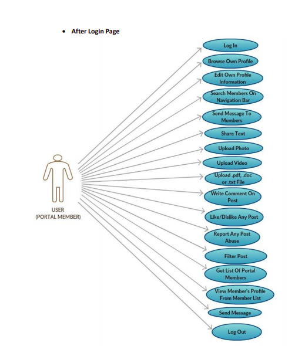
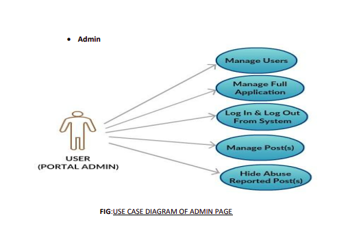

## Implementation of Flask Web 
 This repo contains the source code to a complete social blogging applications with Flask, a python microframework from ground up.
 
### What's included
* User Authentication
* User Roles
* User Profiles
* Blog Posts
* Followers
* User Comments
* API
## Install the application
    git clone 'https//: url .. '
    
### Activate the environment
    $ pip install virtualenv
    $ virtualenv -p python3 env
    $ . venv/bin/activate
    
## Install Flask
    $ pip install Flask
    
## Install the dependencies
    $ pip install -r requirements.txt

## run application 
    $ export FLASK_APP=app.py
    $ flask run
    * Running on http://127.0.0.1:5000/
    
### Deployment to heroku

### Aftre Login :
| | 

